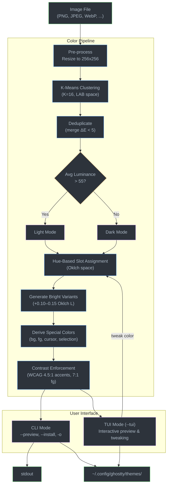

# ghostty-themer — Product Requirements Document

## Overview

**ghostty-themer** is a CLI/TUI application that generates [Ghostty](https://ghostty.org/) terminal color themes from wallpaper images. It extracts dominant colors from an image, maps them to the 16 ANSI color slots plus special terminal colors (background, foreground, cursor, selection), enforces readability constraints, and outputs a ready-to-use Ghostty theme file.

## Goals

- Generate aesthetically pleasing, readable Ghostty themes from any image
- Provide an interactive TUI for previewing and tweaking the generated palette before saving
- Support both dark and light theme generation
- Ensure all generated themes meet minimum contrast requirements for readability
- Install a theme directly into `~/.config/ghostty/themes/` for immediate use

## Non-Goals

- Supporting other terminal emulators (kitty, alacritty, wezterm, etc.) — Ghostty only
- Replacing general-purpose palette extraction tools like pywal or wallust
- Generating non-color config options (font, cursor style, window padding, etc.)

---

## Architecture

### Language & Stack

- **Language**: Rust
- **TUI framework**: [ratatui](https://crates.io/crates/ratatui)
- **Color extraction**: [kmeans-colors](https://crates.io/crates/kmeans-colors) (K-means clustering in LAB space)
- **Image handling**: [image](https://crates.io/crates/image) crate
- **Color space conversions**: [palette](https://crates.io/crates/palette) crate (RGB, LAB, Oklch, sRGB)
- **CLI parsing**: [clap](https://crates.io/crates/clap)

### Why These Choices

- **K-means in LAB space** produces perceptually diverse palettes — better than median-cut for capturing accent colors from complex images.
- **Oklch** for all lightness/saturation adjustments — perceptually uniform, so equal numerical changes produce equal perceived changes. Superior to HSL for palette generation.
- **ratatui** is the de-facto standard Rust TUI library, well-maintained and composable.

### System Diagram



---

## Ghostty Theme Format

Ghostty themes are plain-text key-value files placed in `~/.config/ghostty/themes/<name>` (no file extension). The format:

```
# Comments start with #
background = #1a1b26
foreground = #c0caf5
cursor-color = #c0caf5
selection-background = #33467c
selection-foreground = #c0caf5
palette = 0=#15161e
palette = 1=#f7768e
palette = 2=#9ece6a
palette = 3=#e0af68
palette = 4=#7aa2f7
palette = 5=#bb9af7
palette = 6=#7dcfff
palette = 7=#a9b1d6
palette = 8=#414868
palette = 9=#f7768e
palette = 10=#9ece6a
palette = 11=#e0af68
palette = 12=#7aa2f7
palette = 13=#bb9af7
palette = 14=#7dcfff
palette = 15=#c0caf5
```

### Color Slots

| Slot | Key | Role |
|------|-----|------|
| Background | `background` | Terminal window background |
| Foreground | `foreground` | Default text color |
| Cursor | `cursor-color` | Cursor color |
| Cursor text | `cursor-text` | Text rendered under cursor |
| Selection BG | `selection-background` | Selected text background |
| Selection FG | `selection-foreground` | Selected text foreground |
| Palette 0 | `palette = 0=#...` | Black (dark base) |
| Palette 1 | `palette = 1=#...` | Red |
| Palette 2 | `palette = 2=#...` | Green |
| Palette 3 | `palette = 3=#...` | Yellow |
| Palette 4 | `palette = 4=#...` | Blue |
| Palette 5 | `palette = 5=#...` | Magenta |
| Palette 6 | `palette = 6=#...` | Cyan |
| Palette 7 | `palette = 7=#...` | White (light base) |
| Palette 8–15 | `palette = N=#...` | Bright variants of 0–7 |

**Constraint**: No whitespace around the `=` inside `palette = N=#COLOR` (i.e., `N=#COLOR`, not `N = #COLOR`).

---

## Color Pipeline

### Step 1: Image Pre-processing

1. Load image via the `image` crate (supports PNG, JPEG, WebP, BMP, TIFF, etc.)
2. Resize to max 256x256 (preserving aspect ratio) to improve extraction speed
3. Convert all pixels to LAB color space

### Step 2: Color Extraction

1. Run K-means clustering (K=16) in LAB space using `kmeans-colors`
2. Each cluster centroid becomes a candidate color, weighted by cluster size (pixel count)
3. Deduplicate: merge clusters whose LAB distance is below a threshold (ΔE < 5)
4. If fewer than 8 distinct colors remain, re-run with lower K or fall back to using the available colors with generated variants

### Step 3: Dark/Light Detection

1. Compute the average luminance of the image (mean of L channel in LAB space)
2. If average L > 55: default to **light** theme; otherwise default to **dark** theme
3. User can override via `--mode dark|light`

### Step 4: Color Assignment

Map extracted colors to ANSI slots using hue-based assignment in Oklch space:

1. Convert all candidate colors to Oklch
2. Sort by hue
3. Assign to semantic slots by hue proximity:
   - Red (slot 1): hue ~0°/360°
   - Yellow (slot 3): hue ~60°–90°
   - Green (slot 2): hue ~120°–150°
   - Cyan (slot 6): hue ~180°
   - Blue (slot 4): hue ~240°
   - Magenta (slot 5): hue ~300°
4. For any empty slot, synthesize a color by interpolating between neighbors in Oklch space

**Base colors (slots 0, 7, 8, 15):**

- **Dark theme**:
  - Slot 0 (black): darkest extracted color, darkened further (Oklch L ≤ 0.15)
  - Slot 7 (white): near-white derived from lightest extracted color (Oklch L ~0.85)
  - Slot 8 (bright black): midpoint between slot 0 and 7 (Oklch L ~0.40)
  - Slot 15 (bright white): lightest (Oklch L ~0.93)
- **Light theme**: inverted — slot 0 is light, slot 7 is dark, etc.

**Bright variants (slots 9–14):** increase Oklch lightness of slots 1–6 by a consistent delta (~+0.10–0.15), clamp chroma to avoid oversaturation.

**Special colors:**

- `background`: slot 0 value (dark) or slot 15 value (light)
- `foreground`: slot 15 value (dark) or slot 0 value (light)
- `cursor-color`: foreground color
- `cursor-text`: background color
- `selection-background`: accent color (e.g., slot 4) at reduced opacity/chroma
- `selection-foreground`: foreground color

### Step 5: Contrast Enforcement

For every accent color (slots 1–6, 9–14) against the background:

1. Compute WCAG 2.0 contrast ratio: `(L1 + 0.05) / (L2 + 0.05)` where L is relative luminance
2. If ratio < 4.5:1, adjust Oklch lightness (increase for dark themes, decrease for light themes) until the ratio meets 4.5:1
3. For foreground on background: enforce minimum 7:1 contrast ratio
4. For bright black (slot 8) on background: enforce minimum 3:1 (it's meant to be dim but readable)

### Step 6: Output

Write the theme file in Ghostty's format to either stdout or directly to `~/.config/ghostty/themes/<name>`.

---

## User Interface

### CLI Mode (default)

```
ghostty-themer <IMAGE> [OPTIONS]
```

**Arguments:**
- `<IMAGE>` — Path to wallpaper image file

**Options:**
- `-n, --name <NAME>` — Theme name (defaults to image filename without extension)
- `-m, --mode <MODE>` — Force `dark` or `light` (auto-detected by default)
- `-o, --output <PATH>` — Output file path (default: stdout)
- `--install` — Write directly to `~/.config/ghostty/themes/<NAME>`
- `--preview` — Print a colored preview of the palette to the terminal
- `-k, --colors <N>` — Number of K-means clusters (default: 16)
- `--min-contrast <RATIO>` — Minimum accent contrast ratio (default: 4.5)

**Examples:**
```bash
# Generate and preview
ghostty-themer ~/wallpapers/sunset.jpg --preview

# Generate and install directly
ghostty-themer ~/wallpapers/sunset.jpg --name sunset --install

# Output to file
ghostty-themer ~/wallpapers/sunset.jpg -o ~/mytheme.conf

# Force light theme
ghostty-themer ~/wallpapers/sunset.jpg --mode light --install
```

### TUI Mode

```
ghostty-themer <IMAGE> --tui
```

Launches an interactive terminal UI with:

1. **Image thumbnail** — Small color-block representation of the source image (ratatui half-block rendering)
2. **Palette view** — 16 color swatches showing the current ANSI palette assignments
3. **Preview pane** — Simulated terminal output showing how the theme looks with sample content (e.g., a colorized `ls` output, git diff, syntax-highlighted code snippet)
4. **Controls:**
   - `d` / `l` — Toggle dark/light mode
   - `r` — Regenerate palette (re-run K-means with new random seed)
   - `1`–`6` — Select accent slot, then arrow keys to cycle through extracted candidates for that slot
   - `+` / `-` — Adjust lightness of selected color
   - `s` / `S` — Adjust saturation (chroma) of selected color
   - `Enter` — Save / install theme
   - `q` — Quit without saving
   - `?` — Help overlay

---

## Error Handling

- **Unsupported image format**: Print supported formats list and exit with code 1
- **Image too small** (< 16 pixels): Warn and proceed — K-means may produce limited colors
- **Fewer than 6 distinct colors extracted**: Warn user, fill gaps via Oklch interpolation
- **Config directory doesn't exist**: Create `~/.config/ghostty/themes/` recursively when using `--install`
- **Theme name conflict**: Prompt before overwriting in TUI mode; overwrite silently in CLI mode (or add `--no-clobber` flag)

---

## Testing Strategy

- **Unit tests**: Color space conversion accuracy, contrast ratio calculation, hue-to-slot mapping logic, theme file serialization
- **Snapshot tests**: Given a deterministic seed and known input image, the output theme file should match a saved snapshot
- **Property tests**: Every generated theme should pass contrast validation (no accent color below 4.5:1 against background)
- **Integration tests**: Round-trip — generate a theme, parse the output file, verify all 22 color values are present and valid hex

---

## Future Considerations (out of scope for v1)

- Material You scheme generation via the `material-colors` crate as an alternative extraction mode
- Wallpaper auto-detection (read current wallpaper from desktop environment)
- Live reload — watch wallpaper changes and regenerate
- Ghostty config reload trigger after theme install
- Multiple extraction backends (median-cut, octree) selectable via flag
- Template support for other terminals
