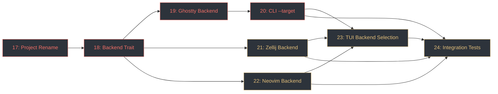

# nuri — Phase 2 Implementation Tickets

Continues from Phase 1 (tickets 1–16, all complete). Tickets are ordered by dependency.
See `PRD-2.md` for full requirements.

---

## Ticket 17: Project Rename ✅

**Status**: DONE
**Priority**: P0
**Blocked by**: —
**Blocks**: 18, 19, 20, 21, 22, 23, 24

Rename the project from `ghostty-themer` to `nuri` across the entire codebase.

**Tasks**:
- `Cargo.toml`: set `name = "nuri"`, update `description`, add `[[bin]] name = "nuri"`
- `src/cli.rs`: update `#[command(name = "nuri", ...)]` and help/about text
- `src/main.rs`: update `use nuri::` imports (crate rename)
- `src/lib.rs`: no structural changes needed (module re-exports stay the same)
- `tests/integration.rs`: update `use nuri::` imports, update binary name in CLI tests (`Command::cargo_bin("nuri")`)
- Regenerate snapshot files if they embed the binary name: `UPDATE_SNAPSHOTS=1 cargo test`
- `CLAUDE.md`: update project overview, all build/run examples, project structure description, binary references
- `product-definition/PRD-1.md`: add a note at the top: *"This project has been renamed to **nuri** (塗り). See PRD-2.md for the evolution."* — keep original content intact as historical reference
- Verify `cargo build`, `cargo test`, `cargo clippy`, `cargo fmt --check` all pass
- Run `./check.sh`

**Acceptance criteria**: `cargo run -- --help` prints `nuri` as the binary name. All tests pass with `use nuri::` imports. Docs reflect the new name and its meaning.

---

## Ticket 18: Backend Trait & Module Structure ✅

**Status**: DONE
**Priority**: P0
**Blocked by**: 17
**Blocks**: 19, 21, 22

Define the `ThemeBackend` trait and create the `backends/` module structure.

**Tasks**:
- Create `src/backends/mod.rs` with:
  ```rust
  pub trait ThemeBackend {
      fn name(&self) -> &str;
      fn serialize(&self, palette: &AnsiPalette, theme_name: &str) -> String;
      fn install(&self, palette: &AnsiPalette, theme_name: &str) -> Result<PathBuf>;
      fn write_to(&self, palette: &AnsiPalette, theme_name: &str, path: &Path) -> Result<()>;
  }
  ```
- Add a `Target` enum: `Ghostty`, `Zellij`, `Neovim` (with `clap::ValueEnum` derive for CLI parsing)
- Add a registry function: `fn get_backend(target: Target) -> Box<dyn ThemeBackend>` that returns the appropriate backend struct
- Add `pub mod backends;` to `src/lib.rs`
- Stub out `src/backends/ghostty.rs`, `src/backends/zellij.rs`, `src/backends/neovim.rs` as empty modules (implemented in tickets 19, 21, 22)
- Unit test: `get_backend()` returns a backend for each `Target` variant

**Acceptance criteria**: `ThemeBackend` trait compiles. `get_backend()` resolves all three variants. `cargo check` passes.

---

## Ticket 19: Extract Ghostty Backend ✅

**Status**: DONE
**Priority**: P0
**Blocked by**: 18
**Blocks**: 20, 23

Move the existing Ghostty serialization logic from `src/theme.rs` into the new backend system with zero behavioral changes.

**Tasks**:
- Move all logic from `src/theme.rs` → `src/backends/ghostty.rs`
- Define `pub struct GhosttyBackend;` implementing `ThemeBackend`:
  - `name()` → `"Ghostty"`
  - `serialize()` → existing `GhosttyTheme::serialize()` logic
  - `install()` → existing `GhosttyTheme::install()` logic, returning the installed path
  - `write_to()` → existing `GhosttyTheme::write_to()` logic
- Move all tests from `theme.rs` into `backends/ghostty.rs` `#[cfg(test)]` module
- Remove `src/theme.rs` — delete it entirely, remove `pub mod theme;` from `lib.rs`
- Update `src/main.rs` to use `GhosttyBackend` via `ThemeBackend` trait instead of `GhosttyTheme`
- Update `src/tui/mod.rs` to call the backend trait's `install()` instead of `GhosttyTheme::install()`
- Verify all existing tests still pass — no behavioral change
- Run `./check.sh`

**Acceptance criteria**: `src/theme.rs` is gone. `cargo run -- image.jpg` produces identical output to before. All existing tests pass. The TUI save flow works.

---

## Ticket 20: CLI `--target` Flag & Multi-Backend Dispatch ✅

**Status**: DONE
**Priority**: P0
**Blocked by**: 19
**Blocks**: 23, 24

Add the `--target` CLI flag and wire up multi-backend dispatch in `main.rs`.

**Tasks**:
- Add to `cli.rs`:
  - `-t, --target <TARGET>` — accepts comma-separated values, default `ghostty`
  - Parse into `Vec<Target>` (custom parser or post-parse split)
- Update `main.rs` CLI flow:
  - Resolve `Vec<Target>` → `Vec<Box<dyn ThemeBackend>>`
  - **stdout** (no `--install`, no `-o`): error if multiple targets, otherwise call `backend.serialize()` and print
  - **`-o`**: error if multiple targets, otherwise call `backend.write_to()`
  - **`--install`**: iterate all backends, call `backend.install()` for each, print install path per backend
  - **`--preview`**: unchanged (operates on `AnsiPalette`, backend-agnostic)
- Validation errors:
  - `"cannot use --output with multiple targets; use --install instead"`
  - `"cannot output multiple targets to stdout; use --install or specify a single --target"`
- Backwards compatibility: `nuri image.jpg` (no `--target`) defaults to Ghostty, behaves identically to Phase 1
- Run `./check.sh`

**Acceptance criteria**: `nuri image.jpg` still defaults to Ghostty stdout. `nuri image.jpg --target zellij` outputs to stdout. `nuri image.jpg --target ghostty,zellij --install` installs both. Invalid combos produce clear errors.

---

## Ticket 21: Zellij Backend ✅

**Status**: DONE
**Priority**: P1
**Blocked by**: 18
**Blocks**: 23, 24

Implement the Zellij theme backend that outputs KDL format.

**Tasks**:
- Implement `pub struct ZellijBackend;` in `src/backends/zellij.rs` implementing `ThemeBackend`:
  - `name()` → `"Zellij"`
  - `serialize()` → KDL output (see format below)
  - `install()` → write to `$XDG_CONFIG_HOME/zellij/themes/<name>.kdl`, create dir recursively
  - `write_to()` → write serialized content to arbitrary path
- **Color mapping** from `AnsiPalette`:
  - `fg` ← `palette.foreground`
  - `bg` ← `palette.background`
  - `black` ← `slots[0]`, `red` ← `slots[1]`, `green` ← `slots[2]`, `yellow` ← `slots[3]`, `blue` ← `slots[4]`, `magenta` ← `slots[5]`, `cyan` ← `slots[6]`, `white` ← `slots[7]`
  - `orange` ← **derived**: interpolate in Oklch between slot 1 (red) and slot 3 (yellow) — target hue ~55°, average lightness and chroma of the two sources
- **KDL output format**:
  ```kdl
  themes {
      <theme-name> {
          fg "#rrggbb"
          bg "#rrggbb"
          black "#rrggbb"
          ...
          orange "#rrggbb"
      }
  }
  ```
- Hex values lowercase, quoted with double quotes
- Indentation: 4 spaces per nesting level
- Trailing newline after closing braces
- Unit tests:
  - Serialization output contains all 11 color keys (`fg`, `bg`, `black`, `red`, `green`, `yellow`, `blue`, `magenta`, `cyan`, `white`, `orange`)
  - Theme name is embedded in KDL structure
  - Hex values are lowercase and double-quoted
  - Orange is not `#000000` — it's a valid derived color
  - `install()` creates file at correct path with `.kdl` extension
  - Snapshot test against a known palette
- Run `./check.sh`

**Acceptance criteria**: `nuri image.jpg --target zellij` outputs a valid KDL theme. `--install` places it in the correct Zellij themes directory. Orange color is visually between red and yellow.

---

## Ticket 22: Neovim Backend

**Status**: TODO
**Priority**: P1
**Blocked by**: 18
**Blocks**: 23, 24

Implement the Neovim colorscheme backend that outputs a Lua file.

**Tasks**:
- Implement `pub struct NeovimBackend;` in `src/backends/neovim.rs` implementing `ThemeBackend`:
  - `name()` → `"Neovim"`
  - `serialize()` → Lua colorscheme output (see structure below)
  - `install()` → write to `$XDG_CONFIG_HOME/nvim/colors/<name>.lua`, create dir recursively
  - `write_to()` → write serialized content to arbitrary path
- **Theme name sanitization**: replace characters outside `[a-z0-9_-]` with `_`, warn on stderr if modified
- **Surface color derivation**: shift background Oklch L by +0.03 (dark mode) or -0.03 (light mode). The backend needs to know the theme mode — accept it as a parameter or detect from palette lightness (background L < 0.5 → dark)
- **Lua file structure** (emitted as a single string):
  1. Header comment: `-- nuri: <name>` / `-- Generated from <image> by nuri`
  2. Boilerplate: `highlight clear`, `syntax reset`, `vim.g.colors_name = "<name>"`
  3. `local c = { ... }` — palette table with 21 color variables (see PRD-2 palette variables table)
  4. `local hl = vim.api.nvim_set_hl` — local alias
  5. Editor UI groups (~30 groups — see PRD-2)
  6. Diagnostic groups (8 groups)
  7. Vim syntax groups (~30 groups)
  8. TreeSitter groups (~40 groups, mix of direct color and `link`)
- **All highlight groups** from the PRD-2 tables must be emitted — no omissions
- `link` groups use `{ link = "GroupName" }` syntax
- All color values are lowercase hex
- Unit tests:
  - Output starts with `-- nuri:` header
  - `vim.g.colors_name` is set to the theme name
  - All essential groups present: `Normal`, `Comment`, `String`, `Function`, `Keyword`, `Type`, `Error`, `Visual`, `CursorLine`, `StatusLine`, `LineNr`, `Pmenu`, `PmenuSel`, `Search`, `DiagnosticError`
  - All `c.<name>` references in `hl()` calls correspond to keys in the `local c = {}` table
  - No syntax errors in Lua output (validate balanced braces, quotes, parentheses)
  - `install()` creates file at correct path with `.lua` extension
  - Snapshot test against a known palette
- Run `./check.sh`

**Acceptance criteria**: `nuri image.jpg --target neovim` outputs a valid Lua colorscheme. Loading it in Neovim (`:luafile %`) produces no errors. All ~108 highlight groups from PRD-2 are present.

---

## Ticket 23: TUI Backend Selection

**Status**: TODO
**Priority**: P1
**Blocked by**: 19, 20, 21, 22
**Blocks**: 24

Add a backend selection popup to the TUI save flow.

**Tasks**:
- Modify `TuiApp` to hold:
  - `targets: Vec<Target>` — from `--target` CLI arg (if specified)
  - Available backends list (all three)
- Modify the save flow (currently triggered by `Enter`):
  - If `--target` was specified on launch → skip popup, use those targets directly
  - If no `--target` → show a popup overlay: `[G]hostty  [Z]ellij  [N]eovim  [a]ll`
  - Popup uses toggle-style selection (highlight = selected), confirm with `Enter`
  - Allow selecting multiple backends before confirming
- After backend selection:
  - Name input prompt appears (existing behavior)
  - Install theme for each selected backend
  - Status bar shows result per backend: `"Installed 'sunset' for Ghostty, Zellij"`
- Handle errors per backend: if one install fails, continue with others and report failures
- Add the backend selection state to `TuiApp` (popup visible, selected backends)
- Unit tests: not applicable (TUI is tested manually)
- Run `./check.sh`

**Acceptance criteria**: TUI save with no `--target` shows the backend picker. TUI save with `--target zellij` skips the picker and saves directly. Multiple backends can be selected and saved in one action. Status bar confirms which backends were installed.

---

## Ticket 24: Integration Tests

**Status**: TODO
**Priority**: P1
**Blocked by**: 20, 21, 22
**Blocks**: —

Comprehensive integration tests for the multi-backend system.

**Tasks**:
- **CLI target tests** (in `tests/integration.rs`):
  - Default (no `--target`) → output matches Ghostty format (backwards compatibility)
  - `--target ghostty` → Ghostty format
  - `--target zellij` → KDL format (contains `themes {`)
  - `--target neovim` → Lua format (contains `vim.g.colors_name`)
  - `--target ghostty,zellij,neovim --install` → all three files created at correct paths
  - `--target ghostty,zellij` (no `--install`, no `-o`) → error message about multiple targets
  - `--target ghostty,zellij -o out.txt` → error message about `-o` with multiple targets
- **Snapshot tests**:
  - Zellij snapshot: generate from deterministic test palette, compare to `tests/snapshots/zellij_*.snap`
  - Neovim snapshot: generate from deterministic test palette, compare to `tests/snapshots/neovim_*.snap`
  - Existing Ghostty snapshots still pass
- **Trait-level tests**:
  - For each backend: `serialize()` returns non-empty string for any valid palette
  - For each backend: `install()` creates a file at the expected path (use temp dir via `$XDG_CONFIG_HOME` override)
  - For each backend: `write_to()` creates a file whose contents match `serialize()`
- **Property tests** (proptest):
  - For any valid `AnsiPalette`, all three backends produce non-empty output
  - Zellij output always contains exactly 11 color keys
  - Neovim output always contains `vim.g.colors_name`
- Run `./check.sh`

**Acceptance criteria**: `cargo test` passes. All three backends have snapshot coverage. Error cases are tested. Property tests validate invariants across random palettes.

---

## Dependency Graph



**Critical path**: 17 → 18 → 19 → 20 (minimum to have a working `--target` flag with Ghostty)

**Parallelizable after ticket 18**: Tickets 21 (Zellij) and 22 (Neovim) can be built in parallel with ticket 19, since they only depend on the trait definition.

---

## Summary

| # | Ticket | Priority | Est. Complexity | Depends on |
|---|--------|----------|-----------------|------------|
| 17 | Project Rename | P0 | Low | — |
| 18 | Backend Trait & Module Structure | P0 | Low | 17 |
| 19 | Extract Ghostty Backend | P0 | Medium | 18 |
| 20 | CLI `--target` Flag | P0 | Medium | 19 |
| 21 | Zellij Backend | P1 | Medium | 18 |
| 22 | Neovim Backend | P1 | High | 18 |
| 23 | TUI Backend Selection | P1 | Medium | 19, 20, 21, 22 |
| 24 | Integration Tests | P1 | Medium | 20, 21, 22 |
