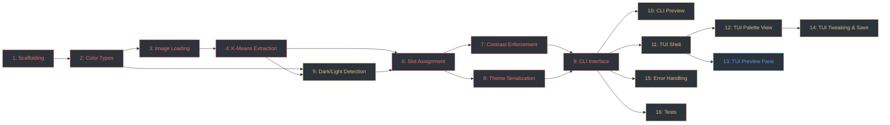

# ghostty-themer — Implementation Tickets

Tickets are ordered by dependency. Each ticket lists what it blocks so you can
see the critical path at a glance.

---

## Ticket 1: Project Scaffolding ✅

**Status**: DONE
**Priority**: P0
**Blocked by**: —
**Blocks**: All other tickets

Set up the Rust project structure with all dependencies.

**Tasks**:
- `cargo init` with edition 2021
- Add dependencies to `Cargo.toml`:
  - `clap` (derive feature)
  - `image`
  - `kmeans-colors` (with `palette_color` feature)
  - `palette`
  - `ratatui` + `crossterm`
  - `anyhow` (error handling)
- Create module structure:
  ```
  src/
    main.rs          # Entry point, CLI dispatch
    cli.rs           # Clap arg definitions
    pipeline/
      mod.rs
      extract.rs     # Image loading, K-means extraction
      detect.rs      # Dark/light mode detection
      assign.rs      # Hue-based ANSI slot assignment
      contrast.rs    # WCAG contrast enforcement
    theme.rs         # GhosttyTheme struct, serialization, install
    tui/
      mod.rs         # TUI app loop
      widgets.rs     # Custom ratatui widgets
  ```
- Stub out each module with placeholder types/functions
- Verify `cargo check` passes

**Acceptance criteria**: `cargo check` succeeds. Running `cargo run -- --help` prints a placeholder help message.

---

## Ticket 2: Color Types & Conversions ✅

**Status**: DONE
**Priority**: P0
**Blocked by**: Ticket 1
**Blocks**: Tickets 3, 4, 5, 6, 7, 8

Define the core color types used throughout the pipeline and conversion utilities.

**Tasks**:
- Define a `Color` wrapper around `palette::Srgb<u8>` that provides conversions to/from:
  - `palette::Lab` (for K-means and deduplication)
  - `palette::Oklch` (for hue assignment, lightness/chroma adjustments)
  - Hex string `#RRGGBB` (for theme serialization)
- Implement `relative_luminance(&self) -> f32` using the sRGB linearization formula
- Implement `contrast_ratio(c1, c2) -> f32` using WCAG 2.0 formula
- Implement `adjust_lightness(&self, delta: f32) -> Color` operating in Oklch space
- Implement `adjust_chroma(&self, delta: f32) -> Color` operating in Oklch space
- Unit tests for:
  - Round-trip: `Srgb -> Lab -> Srgb` preserves values (within rounding)
  - Round-trip: `Srgb -> Oklch -> Srgb` preserves values (within rounding)
  - Known contrast ratios: black/white = 21:1, known mid-gray values
  - Hex serialization: `Color::from_hex("#ff8800")` round-trips

**Acceptance criteria**: All unit tests pass. `cargo test -- color` runs cleanly.

---

## Ticket 3: Image Loading & Pre-processing ✅

**Status**: DONE
**Priority**: P0
**Blocked by**: Ticket 2
**Blocks**: Ticket 4

Load an image, resize it, and convert pixels to LAB for extraction.

**Tasks**:
- Implement `load_and_prepare(path: &Path) -> Result<Vec<Lab>>`:
  1. Open image via `image::open()`
  2. Resize to fit within 256x256 using Lanczos3 filter, preserving aspect ratio
  3. Convert each pixel to `palette::Lab`
  4. Return the pixel vec
- Handle error cases:
  - File not found → descriptive error message
  - Unsupported format → list supported formats in error
- Unit test with a small embedded test image (e.g., a 4x4 PNG in `tests/fixtures/`)

**Acceptance criteria**: Given a JPEG/PNG, returns a `Vec<Lab>` with correct count (width × height after resize). Errors are clear and actionable.

---

## Ticket 4: K-Means Color Extraction

**Priority**: P0
**Blocked by**: Ticket 3
**Blocks**: Tickets 5, 6

Extract dominant colors from the prepared pixel data.

**Tasks**:
- Implement `extract_colors(pixels: &[Lab], k: usize) -> Vec<ExtractedColor>` where `ExtractedColor` holds `{ color: Color, weight: f32 }` (weight = fraction of pixels in cluster)
- Use `kmeans_colors::get_kmeans_hamerly()` with configurable K (default 16), max 20 iterations, convergence threshold 5.0
- Post-process: deduplicate centroids with ΔE < 5.0 in LAB space, merging weights
- If fewer than 8 distinct colors remain after dedup, keep what we have (downstream will fill gaps)
- Sort results by weight descending
- Unit tests:
  - A uniform-color image produces 1 dominant color
  - A 2-color image (e.g., half red / half blue) produces 2 dominant colors with ~equal weight

**Acceptance criteria**: Extracts a reasonable palette from test images. Deduplication reduces near-identical clusters.

---

## Ticket 5: Dark/Light Mode Detection

**Priority**: P1
**Blocked by**: Ticket 4
**Blocks**: Ticket 6

Determine whether the image is predominantly dark or light.

**Tasks**:
- Implement `detect_mode(pixels: &[Lab]) -> ThemeMode` where `ThemeMode` is `Dark | Light`
- Compute mean of L channel across all pixels
- Threshold: L > 55 → Light, otherwise → Dark
- Allow user override via `ThemeMode` enum passed from CLI args
- Unit tests:
  - All-black image → Dark
  - All-white image → Light
  - Known mid-gray image near threshold

**Acceptance criteria**: Correctly classifies obviously dark/light images. Override works.

---

## Ticket 6: Hue-Based Slot Assignment

**Priority**: P0
**Blocked by**: Tickets 4, 5
**Blocks**: Tickets 7, 8

Map extracted colors to the 16 ANSI palette slots.

**Tasks**:
- Implement `assign_slots(colors: &[ExtractedColor], mode: ThemeMode) -> AnsiPalette`
- `AnsiPalette` holds `[Color; 16]` plus `background`, `foreground`, `cursor_color`, `cursor_text`, `selection_bg`, `selection_fg`
- **Accent assignment (slots 1–6)**:
  1. Convert candidates to Oklch
  2. For each target hue (Red=25°, Green=145°, Yellow=90°, Blue=260°, Magenta=325°, Cyan=195°), find the candidate with the smallest hue distance
  3. If no candidate is within 60° of a target hue, synthesize by taking the nearest candidate and rotating its hue to the target in Oklch space
- **Base colors (slots 0, 7, 8, 15)**:
  - Dark mode: slot 0 = darkest candidate clamped to L≤0.15; slot 7 = L~0.85; slot 8 = L~0.40; slot 15 = L~0.93
  - Light mode: inverted
- **Bright variants (slots 9–14)**: copy slots 1–6, increase Oklch L by 0.12, clamp chroma
- **Special colors**: derive from palette as specified in PRD
- Unit tests:
  - Given a known set of 6 diverse-hue colors, each lands in the correct slot
  - Gaps (e.g., no green candidate) are filled via synthesis

**Acceptance criteria**: Produces a full 16-color palette + special colors from any set of extracted colors. No slot is left empty.

---

## Ticket 7: Contrast Enforcement

**Priority**: P0
**Blocked by**: Ticket 6
**Blocks**: Ticket 9

Adjust palette colors to meet WCAG contrast minimums.

**Tasks**:
- Implement `enforce_contrast(palette: &mut AnsiPalette)`
- For each accent color (slots 1–6, 9–14) vs `background`:
  - Compute WCAG contrast ratio
  - If < 4.5:1, iteratively adjust Oklch L (increase for dark, decrease for light) in steps of 0.01 until ratio ≥ 4.5
  - Cap iterations at 100 to avoid infinite loop on degenerate inputs
- For `foreground` vs `background`: enforce ≥ 7:1
- For slot 8 (bright black) vs `background`: enforce ≥ 3:1
- Preserve hue and chroma as much as possible — only adjust lightness
- Unit tests:
  - A palette with a low-contrast color gets its lightness adjusted
  - A palette already meeting contrast is unchanged
  - Property test: after enforcement, every slot passes its respective threshold

**Acceptance criteria**: No generated palette ever has an accent below 4.5:1 contrast against its background.

---

## Ticket 8: Ghostty Theme Serialization

**Priority**: P0
**Blocked by**: Ticket 6
**Blocks**: Ticket 9

Serialize an `AnsiPalette` to the Ghostty theme file format.

**Tasks**:
- Implement `GhosttyTheme` struct with a `fn serialize(&self) -> String` method
- Output format (exact whitespace matters):
  ```
  background = #RRGGBB
  foreground = #RRGGBB
  cursor-color = #RRGGBB
  cursor-text = #RRGGBB
  selection-background = #RRGGBB
  selection-foreground = #RRGGBB
  palette = 0=#RRGGBB
  palette = 1=#RRGGBB
  ...
  palette = 15=#RRGGBB
  ```
- No whitespace around the inner `=` in palette lines
- Implement `fn install(&self, name: &str) -> Result<()>`:
  - Resolve `$XDG_CONFIG_HOME/ghostty/themes/` (default `~/.config/ghostty/themes/`)
  - Create directory recursively if needed
  - Write file with theme name as filename (no extension)
- Implement `fn write_to(&self, path: &Path) -> Result<()>` for `-o` output
- Unit tests:
  - Serialized output matches expected format exactly (snapshot test)
  - `palette = N=#` lines have no space around inner `=`
  - Install creates correct file path

**Acceptance criteria**: Output file is a valid Ghostty theme. `ghostty +list-themes` shows the installed theme.

---

## Ticket 9: CLI Interface

**Priority**: P0
**Blocked by**: Tickets 7, 8
**Blocks**: Tickets 10, 12

Wire together the full CLI flow: image → pipeline → output.

**Tasks**:
- Define CLI args with clap (derive):
  - `<IMAGE>` — required positional arg
  - `-n, --name` — optional, defaults to image stem
  - `-m, --mode` — optional enum: `dark`, `light`
  - `-o, --output` — optional output path
  - `--install` — flag
  - `--preview` — flag
  - `--tui` — flag
  - `-k, --colors` — optional, default 16
  - `--min-contrast` — optional, default 4.5
- Implement the default (non-TUI) flow in `main.rs`:
  1. Parse args
  2. `load_and_prepare()`
  3. `extract_colors()`
  4. `detect_mode()` (respecting `--mode` override)
  5. `assign_slots()`
  6. `enforce_contrast()`
  7. `GhosttyTheme::from(palette)`
  8. Output: `--install` → install, `-o` → write to file, otherwise → stdout
- Validate arg combinations (e.g., `--install` and `-o` are mutually exclusive)

**Acceptance criteria**: `cargo run -- path/to/image.jpg` prints a valid Ghostty theme to stdout. `--install` places it in the correct directory.

---

## Ticket 10: CLI Preview Mode

**Priority**: P1
**Blocked by**: Ticket 9
**Blocks**: —

Print a colored terminal preview of the generated palette when `--preview` is passed.

**Tasks**:
- Implement `fn print_preview(palette: &AnsiPalette)`
- Output two rows of colored blocks (ANSI escape sequences):
  - Row 1: slots 0–7 (normal colors)
  - Row 2: slots 8–15 (bright colors)
- Below the blocks, show a sample line of "foreground on background" text
- Show the contrast ratios for foreground and the dimmest accent
- Use 24-bit color escape sequences (`\x1b[38;2;R;G;Bm`) since Ghostty supports true color

**Acceptance criteria**: `cargo run -- image.jpg --preview` prints colored blocks and sample text that visually match the generated palette.

---

## Ticket 11: TUI — App Shell & Event Loop

**Priority**: P1
**Blocked by**: Ticket 9
**Blocks**: Tickets 12, 13, 14

Set up the ratatui application skeleton for `--tui` mode.

**Tasks**:
- Implement `TuiApp` struct holding:
  - `palette: AnsiPalette`
  - `extracted_colors: Vec<ExtractedColor>` (original candidates for re-assignment)
  - `image_path: PathBuf`
  - `mode: ThemeMode`
  - `selected_slot: Option<usize>`
  - `theme_name: String`
- Set up crossterm raw mode, alternate screen, event loop
- Define layout (ratatui `Layout::default()`):
  - Top row: image thumbnail (30%) | palette swatches (70%)
  - Bottom row: terminal preview pane (100%)
  - Footer: status bar with keybinding hints
- Handle `q` → quit, `?` → help overlay
- Render placeholder content in each pane

**Acceptance criteria**: `cargo run -- image.jpg --tui` opens a TUI that renders the layout and exits cleanly on `q`.

---

## Ticket 12: TUI — Palette View Widget

**Priority**: P1
**Blocked by**: Ticket 11
**Blocks**: Ticket 14

Render the 16-color palette as interactive swatches.

**Tasks**:
- Implement a `PaletteWidget` for ratatui that:
  - Renders 16 colored blocks in a 8×2 grid (normal row + bright row)
  - Labels each block with its slot number and ANSI name (e.g., "1:Red")
  - Highlights the currently selected slot with a border
  - Shows the hex value of the selected color below the grid
- Wire slot selection: `1`–`6` selects accent slots, `Tab` cycles through all 16

**Acceptance criteria**: Palette renders correctly with accurate colors. Selected slot is visually distinct.

---

## Ticket 13: TUI — Terminal Preview Pane

**Priority**: P2
**Blocked by**: Ticket 11
**Blocks**: —

Show a simulated terminal using the generated theme.

**Tasks**:
- Implement a `PreviewWidget` that renders sample terminal content:
  - A mock shell prompt with colored segments
  - A colorized `ls` output using palette colors for directories (blue), executables (green), symlinks (cyan)
  - A mini git diff snippet with red (deletions) and green (additions)
  - A code snippet with syntax coloring using the accent palette
- Background of the pane uses `palette.background`; text uses `palette.foreground`
- Updates live as the palette changes

**Acceptance criteria**: Preview pane looks like a realistic terminal session using the generated theme colors.

---

## Ticket 14: TUI — Color Tweaking & Save

**Priority**: P1
**Blocked by**: Ticket 12
**Blocks**: —

Enable interactive palette adjustments and saving.

**Tasks**:
- **Mode toggle**: `d` / `l` switches dark/light — re-runs assignment + contrast from the same extracted colors
- **Regenerate**: `r` re-runs K-means with a new random seed, then full pipeline
- **Slot adjustment** (when a slot is selected):
  - `+` / `-` adjusts Oklch lightness by ±0.02
  - `s` / `S` adjusts Oklch chroma by ±0.02
  - Left/Right arrows cycle the slot through alternative extracted candidates
- After any tweak, re-run contrast enforcement and update all panes
- **Save**: `Enter` opens a name input field (pre-filled with current name), then:
  - If theme name already exists, show confirmation prompt
  - Install to `~/.config/ghostty/themes/<name>`
  - Show success message in status bar
- **Quit**: `q` prompts "Unsaved changes, quit?" if palette was modified

**Acceptance criteria**: User can tweak colors interactively, see live updates in the preview, and save a working Ghostty theme.

---

## Ticket 15: Error Handling & Edge Cases

**Priority**: P1
**Blocked by**: Ticket 9
**Blocks**: —

Harden the app against bad inputs.

**Tasks**:
- Image errors: unsupported format → list supported formats; file not found → clear message; permissions → suggest fix
- Tiny images (< 16px total): warn on stderr, proceed with limited palette
- Fewer than 6 extracted colors: warn, fill empty slots via Oklch interpolation (already in assign logic — add the warning)
- `--install` when `$XDG_CONFIG_HOME` is unset: fall back to `~/.config`
- Theme name conflicts with `--install`: overwrite silently (add `--no-clobber` flag to error instead)
- Invalid `--min-contrast` values (< 1.0 or > 21.0): clamp with warning
- Validate image path exists before starting pipeline

**Acceptance criteria**: No panics on any reasonable input. All error messages are actionable.

---

## Ticket 16: Tests

**Priority**: P1
**Blocked by**: Ticket 9
**Blocks**: —

Comprehensive test suite beyond the per-ticket unit tests.

**Tasks**:
- **Test fixtures**: add 3–4 small test images to `tests/fixtures/`:
  - `dark-photo.jpg` — a dark landscape
  - `light-photo.jpg` — a bright/pastel image
  - `monochrome.png` — grayscale image (edge case)
  - `colorful.png` — highly saturated, many distinct colors
- **Snapshot tests**: generate theme from each fixture with a fixed seed, compare to saved snapshots in `tests/snapshots/`
- **Property tests** (use `proptest` or `quickcheck`):
  - For any valid image, the output theme has exactly 22 color values
  - All accent contrast ratios ≥ `min_contrast`
  - All hex values match `#[0-9a-f]{6}`
- **Integration test**: `cargo run -- tests/fixtures/dark-photo.jpg` → parse stdout as a theme → validate structure
- **CLI arg tests**: verify mutually exclusive flags, defaults, help output

**Acceptance criteria**: `cargo test` passes. Coverage includes the happy path, all edge cases from Ticket 15, and at least 3 different image types.

---

## Dependency Graph



**Critical path**: 1 → 2 → 3 → 4 → 6 → 7 → 9 (minimum to produce a working theme from an image)

---

## Summary

| # | Ticket | Priority | Est. Complexity |
|---|--------|----------|-----------------|
| 1 | Project Scaffolding | P0 | Low |
| 2 | Color Types & Conversions | P0 | Medium |
| 3 | Image Loading & Pre-processing | P0 | Low |
| 4 | K-Means Color Extraction | P0 | Medium |
| 5 | Dark/Light Mode Detection | P1 | Low |
| 6 | Hue-Based Slot Assignment | P0 | High |
| 7 | Contrast Enforcement | P0 | Medium |
| 8 | Ghostty Theme Serialization | P0 | Low |
| 9 | CLI Interface | P0 | Medium |
| 10 | CLI Preview Mode | P1 | Low |
| 11 | TUI App Shell & Event Loop | P1 | Medium |
| 12 | TUI Palette View Widget | P1 | Medium |
| 13 | TUI Terminal Preview Pane | P2 | Medium |
| 14 | TUI Color Tweaking & Save | P1 | High |
| 15 | Error Handling & Edge Cases | P1 | Low |
| 16 | Tests | P1 | Medium |
